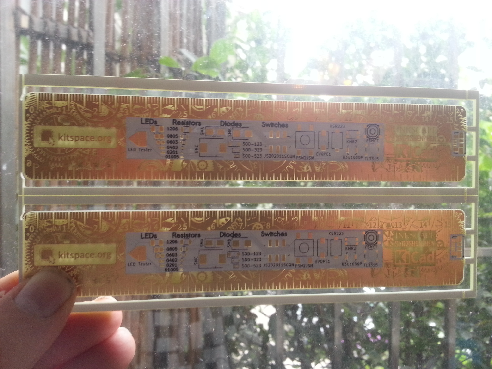

# Kitspace PCB Ruler

A PCB design reference ruler made using Inkscape, [svg2shenzhen](https://github.com/badgeek/svg2shenzhen/) and KiCad (v5). It's up [on Kitspace](https://kitspace.org/boards/github.com/monostable/ruler/) of course.

- You can use it as a ruler and as a reference for footprint sizes when working on a PCB design.
- The front is a functioning circuit if you populate it. The LEDs will light up if you connect it via USB and press the buttons.
- There are also pads for testing LED polarity.
- It's in a panel to show off two different ways to attach designs within a panel: mouse-bites and v-score. These are indicated on the back as well.

<iframe width="560" height="315" src="https://www.youtube.com/embed/yOuZpUTyYj4" frameborder="0" allow="accelerometer; autoplay; encrypted-media; gyroscope; picture-in-picture" allowfullscreen></iframe>

## License

 This work is licensed under a <a rel="license" href="http://creativecommons.org/licenses/by-sa/4.0/">Creative Commons Attribution-ShareAlike 4.0 International License</a>.
